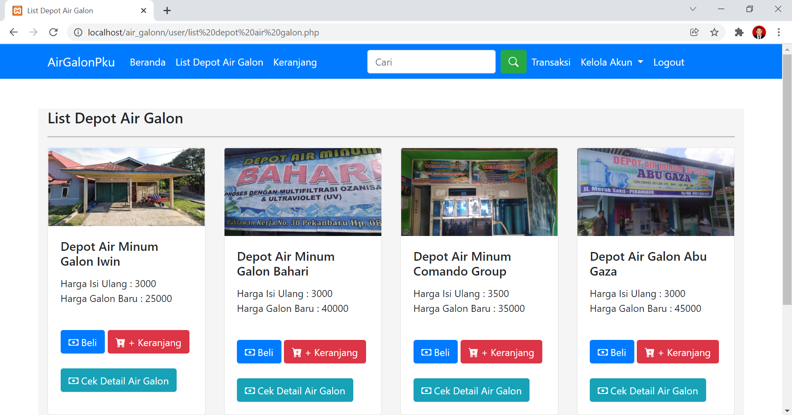
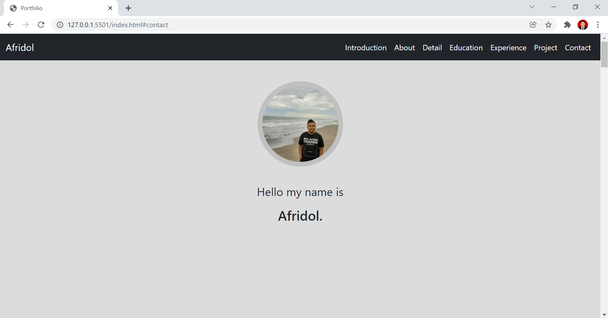

<html lang="en">
    <head>
        <title>Portfolio</title>
        <!-- Required meta tags -->
        <meta charset="UTF-8">
        <meta name="viewport" content="initial-scale=1, minimum-scale=1, maximum-scale=5, user-scalable=no, width=device-width">
        <!-- font-family -->
        <link rel="stylesheet" href="https://fonts.googleapis.com/css?family=Lato">
        <!-- index.css -->
        <link rel="stylesheet" href="index.css">
        <!-- Bootstrap CSS -->
        <link href="https://cdn.jsdelivr.net/npm/bootstrap@5.1.0/dist/css/bootstrap.min.css" rel="stylesheet" integrity="sha384-KyZXEAg3QhqLMpG8r+8fhAXLRk2vvoC2f3B09zVXn8CA5QIVfZOJ3BCsw2P0p/We" crossorigin="anonymous">
        <!-- fontawesome -->
        

        <link rel="shortcut icon" href="background/logo.jpg">
    </head>
    <body>
        <main>
            <!-- header -->
                <!-- navbar -->
                <nav class="navbar navbar-expand-lg navbar-dark bg-dark fixed-top">
                    

                        

                            <a class="navbar-brand" href="#introduction">Afridol</a>
                            <button class="navbar-toggler" type="button" data-bs-toggle="collapse" data-bs-target="#navbarright" aria-controls="navbarText" aria-expanded="false" aria-label="Toggle navigation" id="kanan">
                                
                            </button>
                        

                        <!-- Container wrapper -->
                        

                            <!-- Collapsible wrapper -->
                            

                                <!-- Left links -->
                                <ul class="navbar-nav ms-auto mb-2 mb-lg-0">
                                    <li class="nav-item">
                                        <a class="nav-link active" href="#introduction">Introduction</a>
                                    </li>
                                    <li class="nav-item">
                                        <a class="nav-link active" href="#about">About</a>
                                    </li>
                                    <li class="nav-item">
                                        <a class="nav-link active" href="#personal_detail">Detail</a>
                                    </li>
                                    <li class="nav-item">
                                        <a class="nav-link active" href="#education">Education</a>
                                    </li>
                                    <li class="nav-item">
                                        <a class="nav-link active" href="#experience">Experience</a>
                                    </li>
                                    <li class="nav-item">
                                        <a class="nav-link active" href="#project">Project</a>
                                    </li>
                                    <li class="nav-item">
                                        <a class="nav-link active" aria-current="page" href="#contact">Contact</a>
                                    </li>
                                </ul>
                                <!-- Left links -->
                            

                            <!-- Collapsible wrapper -->
                        

                    

                </nav>
            <!-- section 1 -->
            <section id="introduction">
                

                    

                        
                    
 
                    

                        
Hello my name is 

                        <h3 class="title">Afridol.</h3>
                    

                    <!-- 
 
                        <a href="#about" style="text-decoration: none; color: black;"><i class="fas fa-chevron-circle-down fa-3x"></i></a>
                    
 -->
                

            </section>
            <!-- section 2 -->
            <section id="about">
                

                    

                        

                            <h2 class="title text-center">About</h2> 
                            
 
                                I am fresh graduate of Information Systems at Universitas Islam Negeri Sultan Syarif Kasim Riau. 
                                I have work experience at PT. Oto Multiartha and PT. Summit Oto Finance as a Freelance IT Support. 
                                I had internship at the PT. PLN (Persero) Sektor Pembangkitan Pekanbaru as System Analysist. 
                                I'm currently interested in learning something new, especially in technology. 
                                Currently I am also developing my skills in frontend and backend web developer and also I have an interest in UI UX, Product Manager, as well as all soft skills and hard skills that support my career progress.
                            

                        

                        

                            
                        

                    

                

            </section>
            <!-- section 3 -->
            <section id="personal_detail">
                

                    

                        

                            
                        

                        

                            <h2 class="title text-center">Personal Details</h2> 
                            

                                <i class="fa fa-user"></i>&nbsp;Afridol
                            

                            

                                <i class="fa fa-calendar" aria-hidden="true"></i>&nbsp;Pekanbaru, 12 April 1996
                            

                            

                                <i class="fas fa-map-marker-alt"></i>&nbsp;Pekanbaru, Riau</i>
                            

                            

                                <i class="fas fa-phone"></i>&nbsp;+628 31 8295 3214</i>
                            

                            

                                <i class="fa fa-envelope-o" aria-hidden="true">&nbsp;afridoly@gmail.com</i>
                            

                        

                    

                

            </section>
            <!-- section 4 -->
            <section id="education">
                

                    <h2 class="title text-center">Education</h2> 
                    

                        <h3 class="campus">Universitas Islam Negeri Sultan Syarif Kasim Riau</h3>
                        <h4 class="majors">Information System</h4>
                        
2014 - 2021

                        

                            I studied at Universitas Islam Negeri Sultan Syarif Kasim Riau by majoring in information systems.
                            I finished college by completing a thesis titled "Information System of Gallon Water Distribution in Pekanbaru City Area" and got a GPA of 2.98 from 4.00.
                        

                    

                

            </section>
            <!-- section 5 -->
            <section id="experience">
                

                    <h2 class="title">Experience</h2> 
                    

                        <h3 class="company">PT. Oto Multiartha Pekanbaru</h3>
                        <h4 class="job">Freelance IT Support</h4>
                        
October 2019 - November 2019

                        

                            I work at PT. Oto Multiartha with position as Freelance IT Support from October to November 2019.
                            here what i do is:
                            <ul>
                                <li>Change the old computer to new computer</li>
                                <li>Backup data from old computer to new computer</li>
                                <li>Check and ensure that all new computers used by employees can be used</li>
                                <li>Check and make sure all new computers are connected to the network</li>
                                <li>Check and make sure all applications are running smoothly on the new computer</li>
                                <li>Create technical reports in the form of documentation</li>
                            </ul>
                        

                    

                    

                        <h3 class="company">PT. Summit Oto Finance</h3>
                        <h4 class="job">Freelance IT Support</h4>
                        
September 2019 - October 2019

                        

                            I work at PT. Summit Oto Finance with position as Freelance IT Support from September to October  2019.
                            here what i do is:
                            <ul>
                                <li>Change the old computer to new computer</li>
                                <li>Backup data from old computer to new computer</li>
                                <li>Check and ensure that all new computers used by employees can be used</li>
                                <li>Check and make sure all new computers are connected to the network</li>
                                <li>Check and make sure all applications are running smoothly on the new computer</li>
                                <li>Create technical reports in the form of documentation</li>
                            </ul>
                        

                    

                    

                        <h3 class="company">PT. PLN (Persero) Sektor Pembangkitan Pekanbaru</h3>
                        <h4 class="job">System Analysist</h4>
                        
April 2017

                        

                            I had internship at the PT. PLN (Persero) Sektor Pembangkitan Pekanbaru as system analisyst e-logsheet in April 2017.
                        

                    

                

            </section>
            <!-- section 6 -->
            <section id="project">
                

                    <h2 class="title text-center">Project</h2> 
                    

                        

                            

                                
                                

                                    <h6 class="text-center">Project 1</h6>
                                    
This simple website is made using html and css.

                                

                            

                        

                        

                            

                                
                                

                                    <h6 class="text-center">Project 2</h6>
                                    
This simple website is made using html, css, php and mysql. This project was made for my thesis report.

                                

                            

                        

                        

                            

                                
                                

                                    <h6 class="text-center">Project 3</h6>
                                    
This third project is my portfolio, which is made using html, and css.

                                

                            

                        

                    

                

            </section>
            <!-- section 7 -->
            <section id="contact">
                

                    <h2 class="title text-center">Contact</h2> 
                    

                        

                            
Please send message to me if you have anything to say.

                            <form action="form">
                                

                                    <label for="fullname" class="form-label">Fullname</label>
                                    <input type="text" class="form-control" id="fullname" placeholder="Fullname">
                                

                                

                                    <label for="email" class="form-label">Email</label>
                                    <input type="email" class="form-control" id="email" placeholder="Email">
                                

                                

                                    <label for="message" class="form-label">Message</label>
                                    <textarea class="form-control" id="message" rows="3" placeholder="Message"></textarea>
                                

                                

                                    <button type="submit" class="btn btn-lg btn-dark">Send</button>
                                

                            </form>
                        

                        

                            <h4 class="title text-center">Say Hello</h4> 
                            

                                <i class="fas fa-phone"></i>&nbsp;+62 831 8295 3214
                            

                            

                                <i class="fa fa-envelope-o" aria-hidden="true">&nbsp;afridoly@gmail.com</i>
                            

                            

                                <a href="https://www.linkedin.com/in/afridol/" target="_blank" class="text-dark"><i class="fab fa-linkedin fa-2x"></i></a>
                            <a href="https://github.com/afridool" target="_blank" class="text-dark"><i class="fab fa-github fa-2x"></i></a>
                            <a href="https://www.instagram.com/afridol" target="_blank" class="text-dark"><i class="fab fa-instagram fa-2x"></i></a>
                            
                            
                        

                    

                

            </section>
            <!-- footer -->
            <footer class="text-center text-light bg-dark">
                
Created by Afridol

            </footer>
        </main>
        <!-- Optional JavaScript; choose one of the two! -->

        <!-- Option 1: Bootstrap Bundle with Popper -->
        

        <!-- Option 2: Separate Popper and Bootstrap JS 
        
        
        -->
    </body>
</html>
